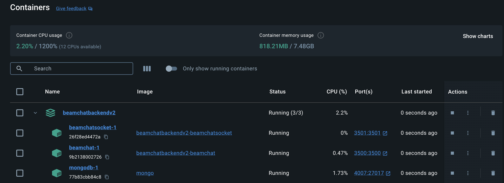

# Beamchat Backend

Beamchat backend serves as the backbone for Beamchat, a scalable and efficient chat service. Leveraging the power of Node.js and microservices architecture, this backend is built with a focus on performance, security, and ease of use. It uses the Universal Pattern for structuring microservices, MongoDB for data persistence, Swagger for API documentation, and several other technologies to ensure a robust backend solution.

## Features

- **Microservices Architecture**: Utilizes a microservices approach for scalability and ease of maintenance.
- **Security**: Implements Helmet for security headers and JSON Web Tokens for secure authentication.
- **Database**: Uses MongoDB, a NoSQL database, for storing and querying data efficiently.
- **Universal Pattern**: Employs the Universal Pattern library for a standardized approach to building microservices.
- **API Documentation**: Integrated Swagger for easy API documentation and testing.

## Getting Started

These instructions will get you a copy of the project up and running on your local machine for development and testing purposes.

### Prerequisites

- Node.js (LTS version recommended)
- MongoDB (locally installed or accessible via the cloud)
- Git
- Docker

### Installation

1. Clone the repository:

```bash
git clone https://github.com/Beamersoft/BeamchatBackendV2.git
cd BeamchatBackendV2
```

2. Install dependencies:

```bash
npm install
```

3. Run the project:

    In order to run the project successfully, it's necessary to build the Docker containers.
    In the root directory, you will see a file **docker-compose.yaml**, make sure Docker and Docker Desktop is installed in your machine and run:

```bash
sudo docker compose up -d
```

You will see three containers running:



- beamchatsocket: Container that mounts the Socket.io backend.
- beamchat: Container that mounts this backend.
- mongodb: Container that mounts MongoDB database, needed for storing all business data.

4. Additionally, I strongly recommend to install a MongoDB database viewer tool like **Studio 3T** to inspect and make changes to data if needed.